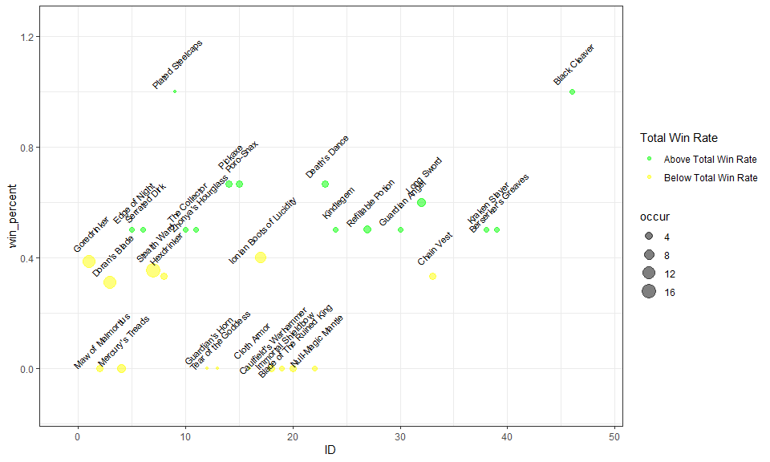

Riot API and Match History Analytics in R
================

### Api Functions

We will use a riot API key for this demo. To register for your own riot
API key please go to <https://developer.riotgames.com/>. The provided
key for this demonstration is
RGAPI-67f20909-15ef-4c0e-94bc-9e072d70c642. Note, this key will only
last for 24 hours. Additional keys you can try are:

- Key 1 RGAPI-67f20909-15ef-4c0e-94bc-9e072d70c642
- Key 2 RGAPI-1b96e96c-d34a-45b0-b02d-85b35af4bef2

### Calling the Api

To use the api, there’s two functions that are called in this analysis,
Endpoint_func.R and Item_func.R.

``` r
source("Endpoint_func.R")
```

    ## Loading required package: RCurl

    ## Loading required package: rjson

    ## Loading required package: stringr

``` r
source("Item_func.R")
```

Endpoint_func contains functions that we use to call the Api. Within the
Endpoint_func, we have the getRIOT function. This acts as an wrapper to
build an URL string. Additional functions such as getSummonerByName
calls the getRiot function and appends additional parameters to build
endpoints that we can query using the API.

For a list of all endpoints, please go to
<https://developer.riotgames.com/apis>

Within Endpoint_func.R, there are three libraries we need to install. If
they are not installed yet, please install them now in your local
environment:

Libraries:

- RCurl : Allows us to download data from Riot’s Api into json format
  using the getURL function
- rjson: Allows us to convert the json format into an R list
- stringr: Allows us to build string transformations to build the
  request URL

Item_func contains functions built on Endpoint_func to perform basic
analysis and return plotting. The analysis provided in Item_func is the
ability to see historical item win rates specific to a League of Legends
player and character. In order to have this functionality, we call the
Endpoint_func.R functions with parameters passed in specific to request
such as summoner name, champion and API key. We also use getURL to query
static game data such as a repository of all the items in the game. An
example of a static json file hosted online is here:
<http://ddragon.leagueoflegends.com/cdn/10.6.1/data/en_US/champion.json>

First, lets get our encrypted_account_id specific to us so we can pull
additional data. For those league players here, you can try your own
summoner name!:

``` r
key = "RGAPI-67f20909-15ef-4c0e-94bc-9e072d70c642"

getSummonerByName('jakeateworld', key = key)
```

    ## [1] "Parsing from endpoint: https://na1.api.riotgames.com/lol/summoner/v4/summoners/by-name/jakeateworld?api_key=RGAPI-67f20909-15ef-4c0e-94bc-9e072d70c642"

    ## $id
    ## [1] "DUkQjvY5ywBY8NA5ECXTJ1ZRkVyqk3FA_CHA8Vexs9KWqoM"
    ## 
    ## $accountId
    ## [1] "RQBMGFwFTvqv-FcJOPPPDuFbSa0ZZuyOMroArOHdLC6L6Q"
    ## 
    ## $puuid
    ## [1] "xtWDaAvaYuWLXZ7o3Bqn760oXRguy203DBTBk1TlhygxBCTjypKjMEcPybvB_EAXLOPFX_hgUWk5CQ"
    ## 
    ## $name
    ## [1] "JAKEATEWORLD"
    ## 
    ## $profileIconId
    ## [1] 4918
    ## 
    ## $revisionDate
    ## [1] 1.667621e+12
    ## 
    ## $summonerLevel
    ## [1] 296

We see that this command returns a list with our accountID, name,
profileIconId, and even summonerLevel! Next, let’s call this again and
store the accountId as an R object called encrypted_account_id.

``` r
encrypted_account_id <- getSummonerByName('jakeateworld', key =key)$puuid
```

    ## [1] "Parsing from endpoint: https://na1.api.riotgames.com/lol/summoner/v4/summoners/by-name/jakeateworld?api_key=RGAPI-67f20909-15ef-4c0e-94bc-9e072d70c642"

``` r
encrypted_account_id
```

    ## [1] "xtWDaAvaYuWLXZ7o3Bqn760oXRguy203DBTBk1TlhygxBCTjypKjMEcPybvB_EAXLOPFX_hgUWk5CQ"

We can then use this encrypted_account_id to return a matchID with and
obtain a match_list R object. If you explore this R object (matches), in
R studio, you can see this contains a plethora of in game data from
items to damage dealt.

``` r
matchID_example <- getGameByPuuid(encrypted_account_id, key = key)[[1]]
```

    ## [1] "Parsing from endpoint: https://americas.api.riotgames.com/lol/match/v5/matches/by-puuid/xtWDaAvaYuWLXZ7o3Bqn760oXRguy203DBTBk1TlhygxBCTjypKjMEcPybvB_EAXLOPFX_hgUWk5CQ/ids?api_key=RGAPI-67f20909-15ef-4c0e-94bc-9e072d70c642"

``` r
matchID_example
```

    ## [1] "NA1_4483419198"

``` r
matches <- getGameByPuuid(encrypted_account_id, key = key)
```

    ## [1] "Parsing from endpoint: https://americas.api.riotgames.com/lol/match/v5/matches/by-puuid/xtWDaAvaYuWLXZ7o3Bqn760oXRguy203DBTBk1TlhygxBCTjypKjMEcPybvB_EAXLOPFX_hgUWk5CQ/ids?api_key=RGAPI-67f20909-15ef-4c0e-94bc-9e072d70c642"

``` r
Game_example <- getGameByMatchID(matchID_example, key = key)
```

    ## [1] "Parsing from endpoint: https://americas.api.riotgames.com/lol/match/v5/matches/NA1_4483419198?api_key=RGAPI-67f20909-15ef-4c0e-94bc-9e072d70c642"

``` r
Game_example$metadata
```

    ## $dataVersion
    ## [1] "2"
    ## 
    ## $matchId
    ## [1] "NA1_4483419198"
    ## 
    ## $participants
    ##  [1] "Oo3Uyz2AhHHQIT2rJw4O8DaKzDf7Lu6_BGvbuLkzFs_W-mcvxMtpnJQr4z_aMOdBkS8R5cMcDwI_Jg"
    ##  [2] "M6Pumh-JyD_cKsFrSerpdKCx9ncfbQCvyy3IKCQ0YM61CsoRDYmVTB48RnPVkZx0OfmvSJbTDbXeAA"
    ##  [3] "xtWDaAvaYuWLXZ7o3Bqn760oXRguy203DBTBk1TlhygxBCTjypKjMEcPybvB_EAXLOPFX_hgUWk5CQ"
    ##  [4] "TaJVfdMYL3tgmEv8XKbbHN4kQuoecRl_H6txmoTHy6lG8Ry58u8AR-W0Ls4AgJ5ZF7KXzsX-KTGfvQ"
    ##  [5] "r9_4su2hU7CJIb-jg_kaf-HW-CT-6AdsVrE6tDgEKyPmVKBHHCrorVK7NxxUp__6RZ5dOKNshlyxkw"
    ##  [6] "0WC-C8kky8r37FFEzU-xH3ORaQMAamNrXXN8UO4-oi_shXcpMOh7T6rLWV5In9eY1CM6jbadHHaHdw"
    ##  [7] "CPKhtF-86sAsIoy5QaqxkM3475Wp6kdFmvJ-TggGxGauEB7rL1jkWCowrxyAF3nIwuMVUE-HNI9XBg"
    ##  [8] "9hzpOYgoZTAYDWlGu0Yovj2yiQuZAy2ZVluHQQqhOLRIiG7Zhjy72HVmTDEzKy6y_PI2_ggDXNY4OQ"
    ##  [9] "HtHr6YgbBte1U2Vet5Gnm_bxz_wfZHJGdA_uEHUWoEYUnPkf50j31hh7qyxaUa-NXpKeIYOSBBTVQg"
    ## [10] "8bx3EWLI8Hy1KZTzpXOSCRiK8mVMAQWxYlP2z-j14mZeoD5mGZO05dPgwl4fYCeM_oYIiWJUyj1vOQ"

### Item Analysis Function and Plotting

Finally, we call our item_analysis function. This function takes the
match_list and static json data to calculate overall winrates from
recent games. Under the hood, item_analysis finds all the matches
associated with the player that is passed in and extracts item
information for every match. Item_analysis then performs transforms for
all the gathered data and consolidates it into a single dataframe.

We can then color code the winrates for further plotting with an item
being Green if it is higher than your total recent game winrates and Red
if worse than your recent game winrates. The function returns a
dataframe called df with the results.

``` r
df <- item_analysis(name = "JAKEATEWORLD", key = key)
```

    ## [1] "Parsing from endpoint: https://na1.api.riotgames.com/lol/summoner/v4/summoners/by-name/jakeateworld?api_key=RGAPI-67f20909-15ef-4c0e-94bc-9e072d70c642"
    ## [1] "Parsing from endpoint: https://americas.api.riotgames.com/lol/match/v5/matches/by-puuid/xtWDaAvaYuWLXZ7o3Bqn760oXRguy203DBTBk1TlhygxBCTjypKjMEcPybvB_EAXLOPFX_hgUWk5CQ/ids?api_key=RGAPI-67f20909-15ef-4c0e-94bc-9e072d70c642"
    ## [1] "Parsing from endpoint: https://americas.api.riotgames.com/lol/match/v5/matches/NA1_4483419198?api_key=RGAPI-67f20909-15ef-4c0e-94bc-9e072d70c642"
    ## [1] "Parsing from endpoint: https://americas.api.riotgames.com/lol/match/v5/matches/NA1_4483378651?api_key=RGAPI-67f20909-15ef-4c0e-94bc-9e072d70c642"
    ## [1] "Parsing from endpoint: https://americas.api.riotgames.com/lol/match/v5/matches/NA1_4483352687?api_key=RGAPI-67f20909-15ef-4c0e-94bc-9e072d70c642"
    ## [1] "Parsing from endpoint: https://americas.api.riotgames.com/lol/match/v5/matches/NA1_4482521261?api_key=RGAPI-67f20909-15ef-4c0e-94bc-9e072d70c642"
    ## [1] "Parsing from endpoint: https://americas.api.riotgames.com/lol/match/v5/matches/NA1_4481902384?api_key=RGAPI-67f20909-15ef-4c0e-94bc-9e072d70c642"
    ## [1] "Parsing from endpoint: https://americas.api.riotgames.com/lol/match/v5/matches/NA1_4474560824?api_key=RGAPI-67f20909-15ef-4c0e-94bc-9e072d70c642"
    ## [1] "Parsing from endpoint: https://americas.api.riotgames.com/lol/match/v5/matches/NA1_4473741426?api_key=RGAPI-67f20909-15ef-4c0e-94bc-9e072d70c642"
    ## [1] "Parsing from endpoint: https://americas.api.riotgames.com/lol/match/v5/matches/NA1_4471663083?api_key=RGAPI-67f20909-15ef-4c0e-94bc-9e072d70c642"
    ## [1] "Parsing from endpoint: https://americas.api.riotgames.com/lol/match/v5/matches/NA1_4461579134?api_key=RGAPI-67f20909-15ef-4c0e-94bc-9e072d70c642"
    ## [1] "Parsing from endpoint: https://americas.api.riotgames.com/lol/match/v5/matches/NA1_4460976734?api_key=RGAPI-67f20909-15ef-4c0e-94bc-9e072d70c642"
    ## [1] "Parsing from endpoint: https://americas.api.riotgames.com/lol/match/v5/matches/NA1_4460410705?api_key=RGAPI-67f20909-15ef-4c0e-94bc-9e072d70c642"
    ## [1] "Parsing from endpoint: https://americas.api.riotgames.com/lol/match/v5/matches/NA1_4459711148?api_key=RGAPI-67f20909-15ef-4c0e-94bc-9e072d70c642"
    ## [1] "Parsing from endpoint: https://americas.api.riotgames.com/lol/match/v5/matches/NA1_4459643794?api_key=RGAPI-67f20909-15ef-4c0e-94bc-9e072d70c642"
    ## [1] "Parsing from endpoint: https://americas.api.riotgames.com/lol/match/v5/matches/NA1_4459529560?api_key=RGAPI-67f20909-15ef-4c0e-94bc-9e072d70c642"
    ## [1] "Parsing from endpoint: https://americas.api.riotgames.com/lol/match/v5/matches/NA1_4459359923?api_key=RGAPI-67f20909-15ef-4c0e-94bc-9e072d70c642"
    ## [1] "Parsing from endpoint: https://americas.api.riotgames.com/lol/match/v5/matches/NA1_4450848550?api_key=RGAPI-67f20909-15ef-4c0e-94bc-9e072d70c642"
    ## [1] "Parsing from endpoint: https://americas.api.riotgames.com/lol/match/v5/matches/NA1_4450615083?api_key=RGAPI-67f20909-15ef-4c0e-94bc-9e072d70c642"
    ## [1] "Parsing from endpoint: https://americas.api.riotgames.com/lol/match/v5/matches/NA1_4450110952?api_key=RGAPI-67f20909-15ef-4c0e-94bc-9e072d70c642"
    ## [1] "Parsing from endpoint: https://americas.api.riotgames.com/lol/match/v5/matches/NA1_4449055069?api_key=RGAPI-67f20909-15ef-4c0e-94bc-9e072d70c642"
    ## [1] "Parsing from endpoint: https://americas.api.riotgames.com/lol/match/v5/matches/NA1_4448360060?api_key=RGAPI-67f20909-15ef-4c0e-94bc-9e072d70c642"
    ## [1] "Current champion win rate is 0.4 at a game count of 20"

``` r
df$Status <- ifelse(df$win_percent > df$total_win_rate, "Green", ifelse(df$total_win_rate < df$total_win_rate, "Red", "Yellow"))
df$ID <- 1:nrow(df)

df <- df[order(df$occur, decreasing = TRUE),]

plot_df <- head(df, n = 30)

head(df, n = 30)
```

    ##                        name win_percent occur total_win_rate Status ID
    ## 7              Stealth Ward   0.3529412    17            0.4 Yellow  7
    ## 1               Goredrinker   0.3846154    13            0.4 Yellow  1
    ## 3             Doran's Blade   0.3076923    13            0.4 Yellow  3
    ## 17 Ionian Boots of Lucidity   0.4000000    10            0.4 Yellow 17
    ## 4          Mercury's Treads   0.0000000     5            0.4 Yellow  4
    ## 32               Long Sword   0.6000000     5            0.4  Green 32
    ## 27        Refillable Potion   0.5000000     4            0.4  Green 27
    ## 2         Maw of Malmortius   0.0000000     3            0.4 Yellow  2
    ## 8                Hexdrinker   0.3333333     3            0.4 Yellow  8
    ## 14                  Pickaxe   0.6666667     3            0.4  Green 14
    ## 15                Poro-Snax   0.6666667     3            0.4  Green 15
    ## 18    Caulfield's Warhammer   0.0000000     3            0.4 Yellow 18
    ## 20 Blade of The Ruined King   0.0000000     3            0.4 Yellow 20
    ## 23            Death's Dance   0.6666667     3            0.4  Green 23
    ## 33               Chain Vest   0.3333333     3            0.4 Yellow 33
    ## 5             Edge of Night   0.5000000     2            0.4  Green  5
    ## 6             Serrated Dirk   0.5000000     2            0.4  Green  6
    ## 10            The Collector   0.5000000     2            0.4  Green 10
    ## 11       Zhonya's Hourglass   0.5000000     2            0.4  Green 11
    ## 19       Immortal Shieldbow   0.0000000     2            0.4 Yellow 19
    ## 22        Null-Magic Mantle   0.0000000     2            0.4 Yellow 22
    ## 24                Kindlegem   0.5000000     2            0.4  Green 24
    ## 30           Guardian Angel   0.5000000     2            0.4  Green 30
    ## 38            Kraken Slayer   0.5000000     2            0.4  Green 38
    ## 39      Berserker's Greaves   0.5000000     2            0.4  Green 39
    ## 46            Black Cleaver   1.0000000     2            0.4  Green 46
    ## 9          Plated Steelcaps   1.0000000     1            0.4  Green  9
    ## 12          Guardian's Horn   0.0000000     1            0.4 Yellow 12
    ## 13      Tear of the Goddess   0.0000000     1            0.4 Yellow 13
    ## 16              Cloth Armor   0.0000000     1            0.4 Yellow 16

Lastly, we can plot our returned dataframe to visualize everything
through the ggplot library!

``` r
library(ggplot2)

ggplot(data = plot_df, aes(x=ID, y=win_percent, label = name))  +
  geom_point(aes(colour = Status, size = occur), alpha = 0.5) + 
  geom_text(aes(x=ID, y=win_percent, label = name), angle = 45, nudge_y = 0.1, nudge_x = 0.1, size = 3) +
  scale_x_continuous(expand = c(.1, .1)) +
  scale_y_continuous(expand = c(.1, .1)) +
  scale_color_manual(name = "Total Win Rate", 
                     values = c("Red" = "Red", "Green" = "Green", "Yellow" = "Yellow"),
                     labels = c("Above Total Win Rate", "Below Total Win Rate", "At Total Win Rate")) + theme_bw()
```


