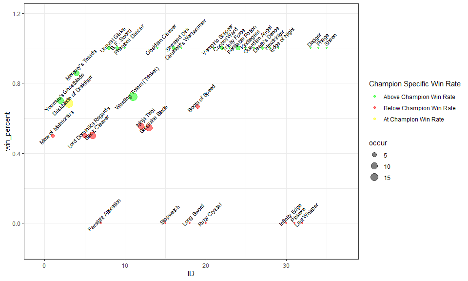

Riot API and Match History Analytics in R
================

The following set of R code demos using Riot's API functionality as a demo for Thomas Winegarden's INFO 201 - Technical Foundations section, this notebook walks step by step through the Analysis.R script which can be run in Rstudio. In order to view this README in Rstudio, open up the Analysis.Rmd file. 

### Api Functions

We will use a riot API key for this demo. To register for your own riot API key please go to <https://developer.riotgames.com/>. The provided key for this demonstration is RRGAPI-fbccf05d-d936-45b3-a744-cc2c268b887b. Note, this key will only last for 24 hours. Additional keys you can try are:

-   Key 1 \[Will add key for demo\]
-   Key 2 \[Will add key for demo\]

### Calling the Api

To use the api, there's two functions that are called in this analysis, Endpoint\_func.R and Item\_func.R.

``` r
source("Endpoint_func.R")
```

    ## Loading required package: RCurl

    ## Warning: package 'RCurl' was built under R version 3.6.3

    ## Loading required package: rjson

    ## Loading required package: stringr

``` r
source("Item_func.R")
```

Endpoint\_func contains functions that we use to call the Api. Within the Endpoint\_func, we have the getRIOT function. This acts as an wrapper to build an URL string. Additional functions such as getSummonerByName calls the getRiot function and appends additional parameters to build endpoints that we can query using the API.

For a list of all endpoints, please go to <https://developer.riotgames.com/apis>

Within Endpoint\_func.R, there are three libraries we need to install. If they are not installed yet, please install them now in your local environment:

Libraries:

-   RCurl : Allows us to download data from Riot's Api into json format using the getURL function
-   rjson: Allows us to convert the json format into an R list
-   stringr: Allows us to build string transformations to build the request URL

Item\_func contains functions built on Endpoint\_func to perform basic analysis and return plotting. The analysis provided in Item\_func is the ability to see historical item win rates specific to a League of Legends player and character. In order to have this functionality, we call the Endpoint\_func.R functions with parameters passed in specific to request such as summoner name, champion and API key. We also use getURL to query static game data such as a repository of all the items in the game. An example of a static json file hosted online is here: <http://ddragon.leagueoflegends.com/cdn/10.6.1/data/en_US/champion.json>

First, lets get our encrypted\_account\_id specific to us so we can pull additional data. For those league players here, you can try your own summoner name!:

``` r
key = "RGAPI-fbccf05d-d936-45b3-a744-cc2c268b887b"
getSummonerByName('jakeateworld', key = key)
```

    ## [1] "Parsing from endpoint: https://na1.api.riotgames.com/lol/summoner/v4/summoners/by-name/jakeateworld?api_key=RGAPI-fbccf05d-d936-45b3-a744-cc2c268b887b"

    ## $id
    ## [1] "QZecT3nQodDTNEj644KlPYUE3T2DttcdzyzBkgXGACmy5SM"
    ## 
    ## $accountId
    ## [1] "plQNvPXtuBJ6CmpH9ExcyzTD8LIo-Z28wdxqXVizOW3P8g"
    ## 
    ## $puuid
    ## [1] "GGJNdvQHX10omaeFNsW02AcjVokAlNlhPVFlAjNatyRrGl9lxCRTqPcDBUvW5Pd3wYR-vHfN1cvj0Q"
    ## 
    ## $name
    ## [1] "JAKEATEWORLD"
    ## 
    ## $profileIconId
    ## [1] 1110
    ## 
    ## $revisionDate
    ## [1] 1.589613e+12
    ## 
    ## $summonerLevel
    ## [1] 134

We see that this command returns a list with our accountID, name, profileIconId, and even summonerLevel! Next, let's call this again and store the accountId as an R object called encrypted\_account\_id.

``` r
encrypted_account_id <- getSummonerByName('jakeateworld', key = key)$accountId
```

    ## [1] "Parsing from endpoint: https://na1.api.riotgames.com/lol/summoner/v4/summoners/by-name/jakeateworld?api_key=RGAPI-fbccf05d-d936-45b3-a744-cc2c268b887b"

``` r
encrypted_account_id
```

    ## [1] "plQNvPXtuBJ6CmpH9ExcyzTD8LIo-Z28wdxqXVizOW3P8g"

We can then use this encrypted\_account\_id to return a matchID with and obtain a match\_list R object. If you explore this R object (match\_list), in R studio, you can see this contains a plethora of in game data from items to firstbloods to many other statistics.

``` r
matchID_example <- getGameBySummonerID(encrypted_account_id, key = key)$matches[[1]]$gameId
```

    ## [1] "Parsing from endpoint: https://na1.api.riotgames.com/lol/match/v4/matchlists/by-account/plQNvPXtuBJ6CmpH9ExcyzTD8LIo-Z28wdxqXVizOW3P8g?api_key=RGAPI-fbccf05d-d936-45b3-a744-cc2c268b887b"

``` r
matchID_example
```

    ## [1] 3422660977

``` r
match_list <- getGameByMatchID(matchID_example, key = key)
```

    ## [1] "Parsing from endpoint: https://na1.api.riotgames.com/lol/match/v4/matches/3422660977?api_key=RGAPI-fbccf05d-d936-45b3-a744-cc2c268b887b"

### Item Analysis Function and Plotting

Finally, we call our item\_analysis function. This function takes the match\_list and static json data to calculate overall champion winrates and the winrates of all items the summoner would buy using that champion. Under the hood, item\_analysis finds all the matches associated with the Champion that is passed in and queries for a match\_list for every match. Item\_analysis then performs transforms for all the gathered data and consolidates it into a single dataframe.

We can then color code the winrates for further plotting with an item being Green if it is higher than your personal champion winrate and Red if worse than your personal champion winrate. The function returns a dataframe called df with the results.

``` r
df <- item_analysis(champion = "Zed", name = "JAKEATEWORLD", key = key)
```

    ## [1] "Parsing from endpoint: https://na1.api.riotgames.com/lol/summoner/v4/summoners/by-name/jakeateworld?api_key=RGAPI-fbccf05d-d936-45b3-a744-cc2c268b887b"
    ## [1] "Parsing from endpoint: https://na1.api.riotgames.com/lol/match/v4/matchlists/by-account/plQNvPXtuBJ6CmpH9ExcyzTD8LIo-Z28wdxqXVizOW3P8g?api_key=RGAPI-fbccf05d-d936-45b3-a744-cc2c268b887b"
    ## [1] "Total games in season: 185"
    ## [1] "Parsing from endpoint: https://na1.api.riotgames.com/lol/match/v4/matches/3420957437?api_key=RGAPI-fbccf05d-d936-45b3-a744-cc2c268b887b"
    ## [1] "Parsing from endpoint: https://na1.api.riotgames.com/lol/match/v4/matches/3419865746?api_key=RGAPI-fbccf05d-d936-45b3-a744-cc2c268b887b"
    ## [1] "Parsing from endpoint: https://na1.api.riotgames.com/lol/match/v4/matches/3412640803?api_key=RGAPI-fbccf05d-d936-45b3-a744-cc2c268b887b"
    ## [1] "Parsing from endpoint: https://na1.api.riotgames.com/lol/match/v4/matches/3412273639?api_key=RGAPI-fbccf05d-d936-45b3-a744-cc2c268b887b"
    ## [1] "Parsing from endpoint: https://na1.api.riotgames.com/lol/match/v4/matches/3409137331?api_key=RGAPI-fbccf05d-d936-45b3-a744-cc2c268b887b"
    ## [1] "Parsing from endpoint: https://na1.api.riotgames.com/lol/match/v4/matches/3407240871?api_key=RGAPI-fbccf05d-d936-45b3-a744-cc2c268b887b"
    ## [1] "Parsing from endpoint: https://na1.api.riotgames.com/lol/match/v4/matches/3407201842?api_key=RGAPI-fbccf05d-d936-45b3-a744-cc2c268b887b"
    ## [1] "Parsing from endpoint: https://na1.api.riotgames.com/lol/match/v4/matches/3405752534?api_key=RGAPI-fbccf05d-d936-45b3-a744-cc2c268b887b"
    ## [1] "Parsing from endpoint: https://na1.api.riotgames.com/lol/match/v4/matches/3404905281?api_key=RGAPI-fbccf05d-d936-45b3-a744-cc2c268b887b"
    ## [1] "Parsing from endpoint: https://na1.api.riotgames.com/lol/match/v4/matches/3404261359?api_key=RGAPI-fbccf05d-d936-45b3-a744-cc2c268b887b"
    ## [1] "Parsing from endpoint: https://na1.api.riotgames.com/lol/match/v4/matches/3403880719?api_key=RGAPI-fbccf05d-d936-45b3-a744-cc2c268b887b"
    ## [1] "Parsing from endpoint: https://na1.api.riotgames.com/lol/match/v4/matches/3403156301?api_key=RGAPI-fbccf05d-d936-45b3-a744-cc2c268b887b"
    ## [1] "Parsing from endpoint: https://na1.api.riotgames.com/lol/match/v4/matches/3401679311?api_key=RGAPI-fbccf05d-d936-45b3-a744-cc2c268b887b"
    ## [1] "Parsing from endpoint: https://na1.api.riotgames.com/lol/match/v4/matches/3394508575?api_key=RGAPI-fbccf05d-d936-45b3-a744-cc2c268b887b"
    ## [1] "Parsing from endpoint: https://na1.api.riotgames.com/lol/match/v4/matches/3394053215?api_key=RGAPI-fbccf05d-d936-45b3-a744-cc2c268b887b"
    ## [1] "Parsing from endpoint: https://na1.api.riotgames.com/lol/match/v4/matches/3393274520?api_key=RGAPI-fbccf05d-d936-45b3-a744-cc2c268b887b"
    ## [1] "Parsing from endpoint: https://na1.api.riotgames.com/lol/match/v4/matches/3392933741?api_key=RGAPI-fbccf05d-d936-45b3-a744-cc2c268b887b"
    ## [1] "Parsing from endpoint: https://na1.api.riotgames.com/lol/match/v4/matches/3391373346?api_key=RGAPI-fbccf05d-d936-45b3-a744-cc2c268b887b"
    ## [1] "Parsing from endpoint: https://na1.api.riotgames.com/lol/match/v4/matches/3389931265?api_key=RGAPI-fbccf05d-d936-45b3-a744-cc2c268b887b"
    ## [1] "Current champion win rate is 0.684210526315789"

``` r
df$Status <- ifelse(df$win_percent > df$champion_winrate, "Green", ifelse(df$win_percent < df$champion_winrate, "Red", "Yellow"))
df$ID <- 1:nrow(df)

head(df, n = 50)
```

    ##                       name win_percent occur champion_winrate Status ID
    ## 1        Maw of Malmortius   0.5000000     2        0.6842105    Red  1
    ## 2      Youmuu's Ghostblade   0.7000000    10        0.6842105  Green  2
    ## 3   Duskblade of Draktharr   0.6842105    19        0.6842105 Yellow  3
    ## 4         Mercury's Treads   0.8571429     7        0.6842105  Green  4
    ## 5   Lord Dominik's Regards   0.5000000     4        0.6842105    Red  5
    ## 6            Black Cleaver   0.5000000    10        0.6842105    Red  6
    ## 7      Farsight Alteration   0.0000000     1        0.6842105    Red  7
    ## 8            Umbral Glaive   1.0000000     2        0.6842105  Green  8
    ## 9              B. F. Sword   1.0000000     2        0.6842105  Green  9
    ## 10          Phantom Dancer   1.0000000     1        0.6842105  Green 10
    ## 11 Warding Totem (Trinket)   0.7222222    18        0.6842105  Green 11
    ## 12              Ninja Tabi   0.5555556     9        0.6842105    Red 12
    ## 13          Sanguine Blade   0.5454545    11        0.6842105    Red 13
    ## 14        Obsidian Cleaver   1.0000000     1        0.6842105  Green 14
    ## 15               Stopwatch   0.0000000     1        0.6842105    Red 15
    ## 16           Serrated Dirk   1.0000000     2        0.6842105  Green 16
    ## 17   Caulfield's Warhammer   1.0000000     1        0.6842105  Green 17
    ## 18              Long Sword   0.0000000     1        0.6842105    Red 18
    ## 19          Boots of Speed   0.6666667     3        0.6842105    Red 19
    ## 20            Ruby Crystal   0.0000000     1        0.6842105    Red 20
    ## 21        Vampiric Scepter   1.0000000     1        0.6842105  Green 21
    ## 22            Control Ward   1.0000000     2        0.6842105  Green 22
    ## 23           Trinity Force   1.0000000     1        0.6842105  Green 23
    ## 24       Refillable Potion   1.0000000     3        0.6842105  Green 24
    ## 25               Kindlegem   1.0000000     1        0.6842105  Green 25
    ## 26          Guardian Angel   1.0000000     1        0.6842105  Green 26
    ## 27           Death's Dance   1.0000000     2        0.6842105  Green 27
    ## 28              Hexdrinker   1.0000000     1        0.6842105  Green 28
    ## 29           Edge of Night   1.0000000     1        0.6842105  Green 29
    ## 30           Infinity Edge   0.0000000     1        0.6842105    Red 30
    ## 31                 Pickaxe   0.0000000     1        0.6842105    Red 31
    ## 32            Last Whisper   0.0000000     1        0.6842105    Red 32
    ## 33                  Dagger   1.0000000     1        0.6842105  Green 33
    ## 34                   Phage   1.0000000     1        0.6842105  Green 34
    ## 35                   Sheen   1.0000000     1        0.6842105  Green 35

Lastly, we can plot our returned dataframe to visualize everything through the ggplot library!

``` r
library(ggplot2)
```

    ## Warning: package 'ggplot2' was built under R version 3.6.3

``` r
options(repr.plot.width=10, repr.plot.height=6)

ggplot(data = df, aes(x=ID, y=win_percent, label = name))  +
  geom_point(aes(colour = Status, size = occur), alpha = 0.5) + 
  geom_text(aes(x=ID, y=win_percent, label = name), angle = 45, nudge_y = 0.05, nudge_x = 0.4, size = 3) +
  scale_x_continuous(expand = c(.1, .1)) +
  scale_y_continuous(expand = c(.1, .1)) +
  scale_color_manual(name = "Champion Specific Win Rate", 
                     values = c("Red" = "Red", "Green" = "Green", "Yellow" = "Yellow"),
                    labels = c("Above Champion Win Rate", "Below Champion Win Rate", "At Champion Win Rate")) + theme_bw()
```


